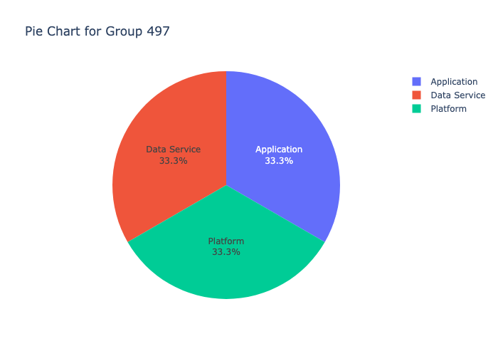

Analytics Dashboard API
=======================

The Analytics Dashboard API is a RESTful API server designed for an analytics dashboard, allowing users to upload data in CSV format, view summary statistics, create visualizations, save visualizations for future reference, and share visualizations with others. This API is implemented in Python 3.8+ using asynchronous programming with asyncio, and it utilizes a PostgreSQL database to store data. The API server provides an OpenAPI specification and is thoroughly tested using pytest.

Table of Contents
-----------------

*   [Getting Started](#getting-started)
*   [API Documentation](#api-documentation)
*   [Technology Choices](#technology-choices)
*   [Improvements and Scaling](#improvements-and-scaling)

Getting Started
---------------

To get the project up and running, follow these steps:

1.  Ensure you have Docker and Docker Compose installed on your machine.
    
2.  Clone the repository:
    
`git clone https://github.com/higorevop/analytics-dashboard-api.git`

3.  Change to the project directory:

    cd analytics-dashboard-api

4.  Build and run the Docker containers:

`docker-compose build docker-compose up`

The API server should now be running on [http://localhost:8000](http://localhost:8000).

API Documentation
-----------------

The API documentation is generated using the OpenAPI specification and can be found at [http://localhost:8000/docs](http://localhost:8000/docs) when the server is running.

Technology Choices
------------------

*   **FastAPI**: FastAPI is a modern, fast, web framework for building APIs with Python. It offers excellent performance, easy integration with asynchronous programming, and built-in support for type hinting and OpenAPI specification generation.
    
*   **PostgreSQL**: A powerful, open-source, object-relational database system known for its robustness, extensibility, and support for advanced data types.
    
*   **SQLAlchemy**: A popular and versatile SQL toolkit and Object-Relational Mapper (ORM) for Python, providing an efficient way to interact with databases.
    
*   **asyncpg**: A high-performance, fully-featured, and easy-to-use asynchronous PostgreSQL driver for Python.
    
*   **Plotly**: A graphing library that makes interactive, publication-quality graphs. In this project, we use Plotly to generate visualizations from the uploaded data.
    

Example of reading a Plotly figure from the API:

```python
import requests
import plotly.graph_objs as go
import plotly.io as pio
import json

url = "http://localhost:8000/497/visualizations/pie_chart"

response = requests.get(url)

if response.status_code == 200:
    json_data = response.json()
    chart_data = json.loads(response.json()["chart_data"])
    data = chart_data['data']
    layout = chart_data['layout']
        
    fig = go.Figure(data=data, layout=layout)

    # Save the figure as a PNG image
    pio.write_image(fig, "pie_chart.png", format="png")
    print("Image saved as pie_chart.png")
else:
    print(f"Error: {response.status_code}, {response.text}")
```


 

Improvements and Scaling
------------------------

*   **Authentication**: Implementing an authentication mechanism, such as OAuth 2.0, to secure the API and allow users to have their own private dashboards.
    
*   **Caching**: Introduce caching mechanisms to optimize performance for frequently accessed data and visualizations.
    
*   **Background tasks**: Process time-consuming tasks, such as generating complex visualizations or large summary statistics, in the background using a task queue like Celery.
    
*   **Horizontal scaling**: Deploy the application to a cloud environment, such as Kubernetes or Amazon ECS, to enable horizontal scaling based on demand.
    
*   **Monitoring and logging**: Implement monitoring and logging tools, such as Prometheus and Grafana, to keep track of the application's health and performance.

[Back to top](#analytics-dashboard-api)
